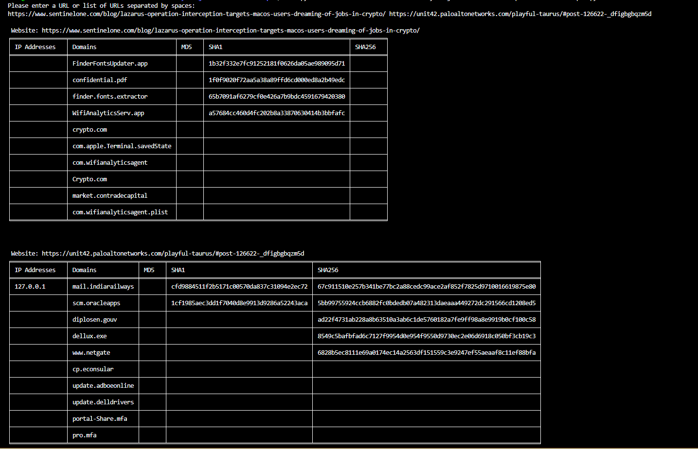
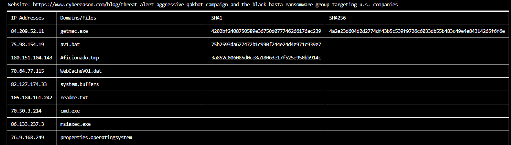

# OSINT IoC Webscraper

This is a simple script for scraping IoC's from your favourite CyberSecurity websites

## Getting Started

Download osint-ioc-scraper.py

Navigate to the directory that contains the file and run python3 osint-ioc-webscraper.py

### Prerequisites

[Python](https://www.python.org/downloads/)
 
[pip](https://pypi.org/project/pip/)

### Dependencies

pip install bs4
 
pip install tabulate

### Demo

